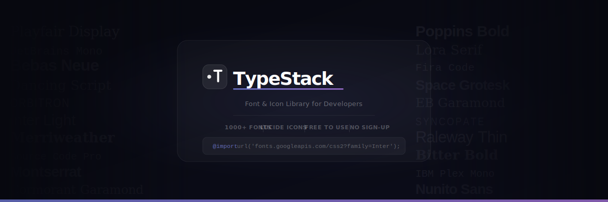

# .T TypeStack



> A free font & icon library built for developers.

Preview 1000+ Google Fonts, copy CSS snippets, download font files, and browse Lucide icons — no sign-up, no friction.

---

## Pages

| Page | Description |
|------|-------------|
| `index.html` | Hero landing page with circuit board background animation |
| `fonts.html` | Font library — live preview, copy CSS, download |
| `icons.html` | Icon library — browse & copy Lucide SVG icons |
| `terms.html` | Terms of Service |
| `privacy.html` | Privacy Policy |

---

## Features

- **1000+ fonts** — sans-serif, serif, monospace, script, display, retro
- **Live preview** — type anything and see it rendered across all fonts instantly
- **One-click CSS** — copy the exact `@import` and `font-family` snippet
- **Direct download** — download font files straight to your machine
- **Icon library** — browse, search, and copy Lucide SVG icons in 16/24/32px
- **AI assistant** — built-in chatbot powered by OpenRouter / GPT-4o-mini
- **Background music** — ambient Blissful.mp3, autoplay on first interaction
- **Circuit board animation** — WebGL canvas background on landing, light rays on inner pages
- **Consent modal** — Terms & Privacy gate on first visit, stored in localStorage
- **Zero tracking** — no accounts, no cookies, no analytics

---

## Stack

- Vanilla HTML, CSS, JavaScript — no frameworks, no build step
- [Google Fonts](https://fonts.google.com) — font serving
- [Lucide Icons](https://lucide.dev) via jsDelivr CDN
- [OpenRouter](https://openrouter.ai) — AI chatbot API
- WebGL — background animations

---

## Setup

Just open any `.html` file in a browser. No install, no build.

```bash
# Serve locally (optional)
npx serve .
```

To enable the AI chatbot, add your OpenRouter API key in `chatbot.js`:

```js
const API_KEY = 'sk-or-v1-your-key-here';
```

> ⚠️ The API key is client-side. For production, proxy requests through a backend.

---

## Project Structure

```
.
├── index.html        # Landing page (served first by GitHub Pages)
├── fonts.html        # Font library
├── icons.html        # Icon library
├── terms.html        # Terms of Service
├── privacy.html      # Privacy Policy
├── chatbot.js        # AI assistant (shared across all pages)
├── favicon.svg       # .T logo mark
└── Blissful.mp3      # Background music
```

---

## License

Fonts are served by Google Fonts under their respective open-source licenses (SIL OFL / Apache 2.0).  
Icons are from [Lucide](https://lucide.dev), licensed under ISC.  
TypeStack itself is open source — use it freely.
